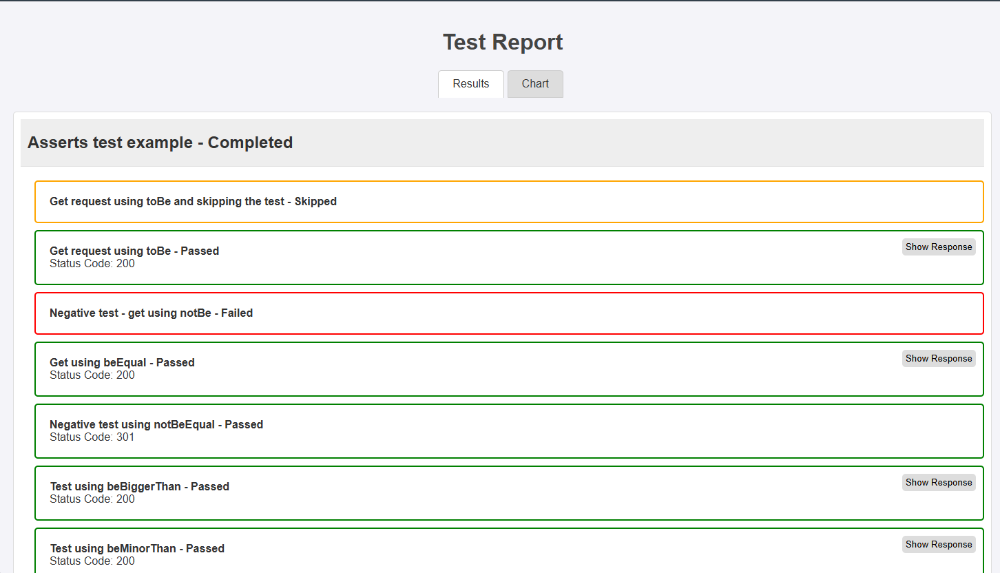
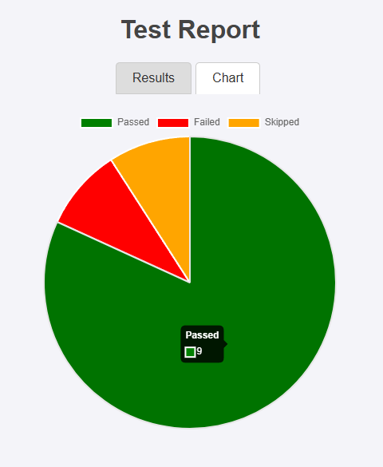

# sqg-api Framework

sqg-api framework is a complete and flexible project built using *TypeScript*. The project was built based on the *jest* and *supertest* frameworks, allowing the use of assertions like toBe, toEqual, etc., and simulating calls from HTTP and HTTPS APIs like supertest. The framework was created to combine the best of both libraries into one. You'll be able to design, run, and check your test results using only this framework.

- [sqg-api Framework](#sqg-api-framework)
  - [Features](#features)
  - [Installation](#installation)
  - [Getting Started](#getting-started)
    - [1. Explore Example Tests:](#1-explore-example-tests)
    - [2. Set up your environment](#2-set-up-your-environment)
    - [3. Run Your Tests:](#3-run-your-tests)
  - [Assertions](#assertions)
  - [Hooks](#hooks)
  - [Test Methods](#test-methods)
  - [How to use the Test Methods](#how-to-use-the-test-methods)
  - [How to use the Test Methods](#how-to-use-the-test-methods-1)
  - [HTML Report](#html-report)
  - [Included Packages](#included-packages)
  - [Customization](#customization)
  - [Contribution](#contribution)
  - [Future implemantations:](#future-implemantations)
  - [License](#license)

## Features

- Faster API testing compared to other frameworks.
- All-in-one framework: Best usage in a single installation framework that allows building API tests and executing HTTP requests.
- Easy-to-Use: Simplifies API testing with preconfigured setups.
- Extensible: Allows customization of validations to match specific requirements.
- TypeScript Support: Ensures type safety and enhanced developer experience.

## Installation
First run to install the framework via npm:

```
npm install sqg-api
```

After run to install to install @types/node
```
npm i --save-dev @types/node
```

At last, let's create the tsconfig.json file:
```
{
  "compilerOptions": {
    "target": "ES2020",
    "module": "CommonJS",
    "outDir": "./dist",
    "rootDir": "./src",
    "strict": true,
    "sourceMap": true,
    "esModuleInterop": true,
    "skipLibCheck": true
  },
  "include": ["src/**/*", "tests/**/*"],
  "exclude": ["node_modules"]
}
```


## Getting Started

### 1. Explore Example Tests:

- The project includes some test examples to help you get started.

- One of the examples demonstrates how to use a pre-setup test with token authentication.

### 2. Set up your environment

- The test examples can be run from the base URLs https://test-api.k6.io/ or https://fakerestapi.azurewebsites.net/index.html, two open-source test APIs.
- If you're using a specific type of authentication, you can set this up in the authentication file. Currently, the test entities are set up to use Bearer token authentication as an example.

### 3. Run Your Tests:

- Let's set up to run all tests using the command bellow:
   
```
npm test
```

- Set up the package.json file like that:

```
 "scripts": {
    "test": "ts-node node_modules/sqg-api/src/core/runner/runner.ts"
  },
```


- The output will be similar to:


## Assertions

The framework allows the use of various assertions, comparing the actual result with the expected result. Below is a complete guide to using the assertions:

```toBe``` 
```notBe```
```beEqual```
```notBeEqual```
```beBiggerThan```
```beMinorThan```
```shouldExists```
```toContain```

You can find test examples in the framework in the test folder -> example-asserts.test.ts. In this file, you can see useful examples like this:

```
testsuite('Asserts test example', () => {

    testcase('Get request using toBe', async () => {
        let req = request(BASE_URL).get('/public/crocodiles/');
        const response = await req.execute();

        expect(response.status).toBe(200);

        return { body: response.body, status: response.status };
    });
});
```

## Hooks
The framework has hooks that can be used like beforeEach, beforeAll, afterEach, and afterAll:

```
beforeEach(async () => {
    console.log('beforeEach executed');
});

```
## Test Methods 

Additionally, the project has some test methods that can be used to build your test suite quickly. These methods have a pre-setup and expect some data as parameters, for example:

```
  public async getList(route: string, statusCode: number, token?: string, content?: any, checkResponseMessage?: string) {
        let req = request(BASE_URL).get(route);

        if (token) {
            req = req.set('Authorization', `Bearer ${token}`);
        }

        const response = await req.execute();

        espera(response.status).ser(statusCode);

        if (content) {
            espera(response.body).queExista();
            espera(response.body).queContenha(content)
        }

        if (checkResponseMessage) {
            espera(response.body.message).ser(checkResponseMessage);
        }

        return response;
    }
```

- As we can see, the test method is almost ready to use; we just need to provide the mandatory **baseUrl**, **route**, and **status code**. If you need to set up a **token**, you can define it in the method, updating the type of token you'll need to use, like Bearer or Basic auth.
  
- The **status code** is already being checked and compared with the status code returned in the request.
  
- The **content** parameter is the content body that you expect in the response. It isn't mandatory, but if provided, it will check the expected data and compare it with the response body in the request.

- The **checkResponseMessage** parameter is also not mandatory, but it is prepared to check and compare with the response message in the request.
  
- To use these methods, you just need to initialize an Entity class like this: ***const entity = new EntityService();***

## How to use the Test Methods

You'll be able to use five different types of almost ready Test Methods: **getById, getList, create, update, and delete.**

Follow the ***getList*** example below:


## How to use the Test Methods

You'll be able to use five different types of almost ready Test Methods: **getById, getList, create, update and delete.**

Follow the ***getList*** example bellow:

```
  testcase('Get testing with token authentication', async () => {
        await entity.getList('BASEURL/my/endpoint/', 200, token);
    });
```

## HTML Report
The framework has an HTML test report that will be created after the test execution. (The report is still in the improvement phase).

 




## Included Packages

The following dependencies are included in the framework:

1.```@types/node```

2.```ts-node```

## Customization

Feel free to extend and adapt the framework to suit your testing needs:

1. **Adding Custom Test Cases:** Add your own test files in the designated test directory.
2. **Configuring Authentication:** Modify the existing examples or create new configurations for different authentication mechanisms.
3. **Modify the test report as you want using HTML**.

## Contribution

Contributions are welcome! If you encounter any issues or have ideas for improvements, feel free to open an issue or submit a pull request on the [GitHub repository](https://github.com/AlexAlexandreAlves/api-test-framework).

## Future implemantations:

1. New assert test methods.
2. Implement tags
3. Improve the report

## License

This project is licensed under the MIT License. See the [LICENSE](https://github.com/AlexAlexandreAlves/sqg-api/blob/master/LICENSE) file for more details.